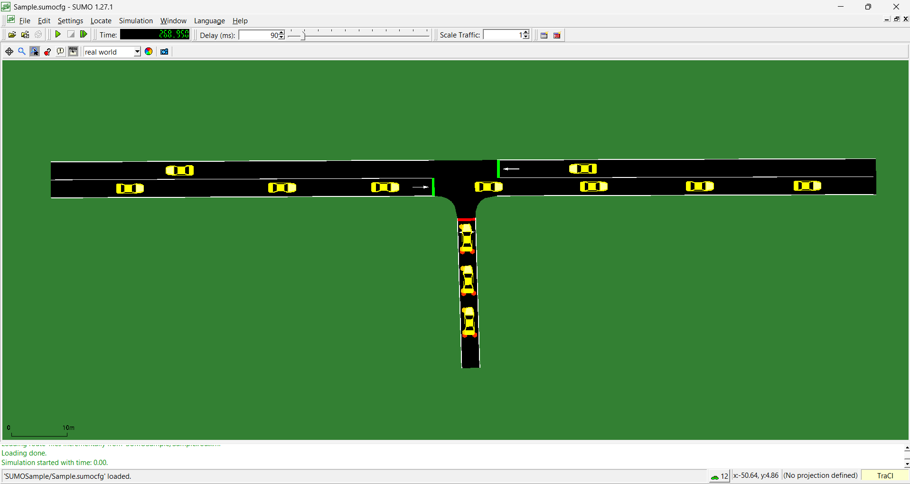
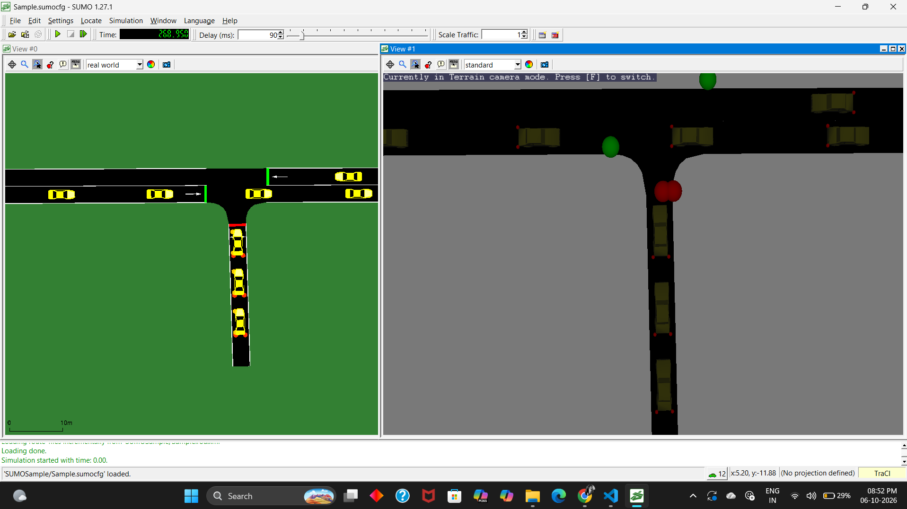
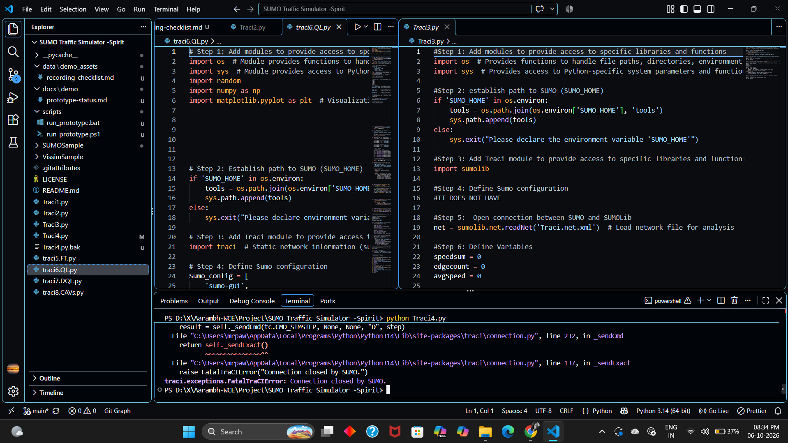

# TrafficTwin AI

> **Aarambh WCE Hackathon 2026 — Day-1 Working Prototype**  
> *Current Stage: ~30–35% Completed (Simulation & Signal Actuation Foundation)*

TrafficTwin AI is an AI-powered traffic flow optimization platform concept that uses a traffic Digital Twin to simulate traffic conditions and test safer signal-control strategies.

---

## Visual Preview

<div align="center">

| SUMO Simulation Runtime | 3D Perspective View |
| :---: | :---: |
|  |  |

</div>

<div align="center">

| Real-Time Controller Execution |
| :---: |
|  |

</div>

---

## Problem Statement

**AI-Powered Traffic Flow Optimization**  
Develop a centralized software platform that ingests real-time public transit and ride-sharing GPS data to dynamically adjust traffic light timings and predict congestion zones.

---

## Current Prototype Status (~30–35% Built)

For Day-1 of the hackathon, our focus is getting the core simulation and actuation engine working locally before layering machine learning models on top. 

Today's working prototype demonstrates:
- **Eclipse SUMO Simulation:** Multi-vehicle flow running through a modeled road network.
- **Python + TraCI Bridge:** Bi-directional live socket connection between our Python controller and SUMO.
- **Signal Monitoring & Control:** Real-time state reads and active phase overrides for junction `J6`.
- **Emergency Vehicle Detection:** Telematics scanning detecting priority vehicles entering corridor `E5`.
- **Dynamic Green Wave Preemption:** Real-time signal preemption forcing green phase (`rGGr`) for the emergency vehicle without human intervention.
- **Automatic Signal Restoration:** Resumes standard cyclic scheduling immediately after the vehicle clears the intersection.

> **Honest Scope Boundary:**  
> Machine learning congestion prediction, live external GPS ingestion, physical city traffic-light hardware control, and the complete Digital Twin planning layer are currently under active development on our roadmap. Today's submission proves the deterministic control pipeline required to safely deploy those models.

---

## Simulation Screen Recordings

Screen recordings demonstrating the end-to-end simulation run and controller terminal logs are organized locally in the repository:

📁 **Directory:** [`docs/screenrecordings/`](docs/screenrecordings/)
- **`Emergency-Green-Signal-SUMO-Simulation.mp4`** — Live demonstration of emergency vehicle detection and junction `J6` green preemption.
- **`Locate-Vehicles-and-Junctions-SUMO-Simulation.mp4`** — Telematics tracking across active edges and intersection geometry.

**Video Link:**  
[▶ Watch the TrafficTwin AI Prototype Simulation](VIDEO_LINK_HERE)  
*(Video demonstration link will be added here before final presentation)*

---

## Prototype Demonstration

The prototype runs locally on Windows, Linux, or macOS with Eclipse SUMO installed.

### Quick Start

1. Ensure Python 3.10+ and Eclipse SUMO are installed.
2. Install TraCI and dependencies:
   ```bash
   pip install eclipse-sumo traci
   ```
3. Run the controller:
   ```bash
   python Traci4.py
   ```

Alternatively, on Windows PowerShell:
```powershell
.\scripts\run_prototype.ps1
```

Or via Windows batch:
```cmd
.\scripts\run_prototype.bat
```

When launched:
1. `sumo-gui` opens showing junction `J6` with vehicle traffic.
2. The Python console logs live vehicle positions and traffic signal phases.
3. At simulation second 10, the emergency vehicle (`emerg_1`) approaches, signal `J6` preempts to green, and resumes normal cycling once cleared.

---

## Project Structure

```
TrafficTwin-AI/
├── SUMOSample/
│   ├── Sample.sumocfg       # Master SUMO configuration
│   ├── Sample.net.xml       # Road network & junction J6 definitions
│   └── Sample.rou.xml       # Traffic flows & emergency vehicle route
├── scripts/
│   ├── run_prototype.ps1    # PowerShell launcher
│   └── run_prototype.bat    # Windows batch launcher
├── docs/
│   ├── screenshots/         # Prototype screenshots
│   │   ├── sumo-simulation.png
│   │   ├── 3d-view-simulation.png
│   │   └── controller-code.png
│   ├── screenrecordings/    # Simulation MP4 recordings & guide
│   │   └── README.md
│   └── demo/
│       └── prototype-status.md
├── data/
│   └── demo_assets/
│       └── recording-checklist.md
├── Traci4.py                # Main TraCI signal controller
├── .gitignore               # Build & environment ignores
└── README.md
```

---

## Technology Stack

- **Simulation Runtime:** Eclipse SUMO 1.27+
- **Control Interface:** TraCI (Traffic Control Interface)
- **Controller Logic:** Python 3.14
- **Network & Route Modeling:** SUMO XML Schema (`.net.xml`, `.rou.xml`, `.sumocfg`)

---

## Development Progress

### Implemented in Current Prototype (30–35%)
- [x] Multi-lane SUMO intersection simulation
- [x] Python-to-SUMO TraCI socket communication
- [x] Live junction signal state monitoring
- [x] Rule-based emergency vehicle identification
- [x] Signal preemption & green duration extension
- [x] Post-clearance automatic cycle restoration

### Planned Next (Day-2 & Beyond)
- [ ] Transit & ride-share GPS telemetry ingestion pipeline
- [ ] GNN / LSTM based congestion zone prediction
- [ ] Spillback-aware adaptive signal timing
- [ ] Multi-intersection corridor synchronization
- [ ] Digital Twin counterfactual planning (Plan A / B / C evaluation)
- [ ] Safety Firewall with fail-safe rollback
- [ ] Web-based monitoring dashboard

---

## References & Attribution

- Simulation framework powered by [Eclipse SUMO](https://eclipse.dev/sumo/) & TraCI.
- Scenario base adapted under MIT License from [RoadwayVR SUMO Tutorial](https://github.com/RoadwayVR/SUMO-Traffic-Simulator-Tutorial).
