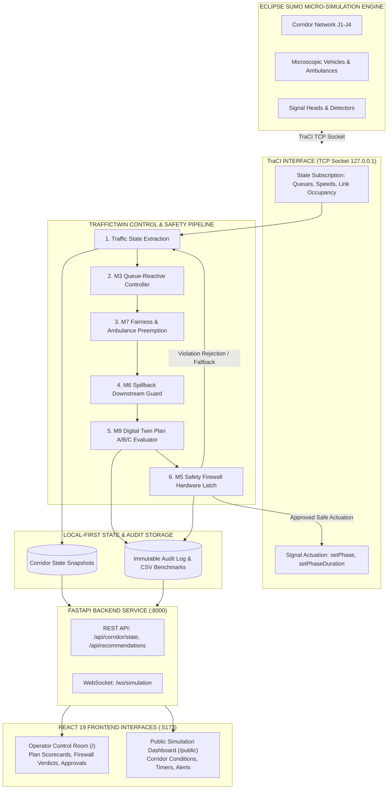

# Document 03 — Architecture & Data Flow

## 1. System Topology & Separation of Concerns

TrafficTwin AI follows a clean **simulation-in-the-loop** digital twin architecture. A strict boundary exists between the physics simulation and the decision-support software:

- **Eclipse SUMO (Physical Ground Truth)**: Models the physical world. Handles microscopic car-following physics (Krauss model), lane-changing behavior, physical link storage, vehicle acceleration, deceleration, collisions, and traffic light head rendering.
- **TrafficTwin Backend (Cognitive & Safety Layer)**: Connects to SUMO via Python TraCI (Traffic Control Interface) over a TCP socket. Collects corridor telemetry, runs the 7-step control pipeline, evaluates Plan A/B/C candidates, enforces safety firewalls, and serves REST/WebSocket APIs.
- **TrafficTwin Frontend (Operator & Public Interface)**: Modern web application built with React 19 and Vite. Visualizes corridor state, provides plan scorecards, records audit trails, and serves a dedicated read-only public portal.

---

## 2. End-to-End Architecture Diagram

---

## 3. The 7-Step Control Chain (Memorize for Viva!)

Every decision in TrafficTwin AI must pass sequentially through these 7 stages. **No stage can bypass the downstream stages:**

$$\mathbf{State} \xrightarrow{1} \mathbf{M3\ (Reactive)} \xrightarrow{2} \mathbf{M7\ (Emergency/Fairness)} \xrightarrow{3} \mathbf{M6\ (Spillback)} \xrightarrow{4} \mathbf{M9\ (Evaluator)} \xrightarrow{5} \mathbf{M5\ (Firewall)} \xrightarrow{6} \mathbf{TraCI\ Actuation} \xrightarrow{7}$$

### Step 1: Traffic State Extraction
- Reads instantaneous queues on main arterial lanes ($Q_{main}$) and cross-street approaches ($Q_{cross}$).
- Computes vehicle count on downstream storage links ($N_{veh}$) and physical link capacity ($N_{cap}$).

### Step 2: Queue-Reactive Control (Module M3)
- If $Q_{main} \ge 3$ vehicles, proposes a $+5\text{s}$ green extension.
- If $Q_{main} < 3$ and $Q_{cross} \ge 3$, proposes a transition to cross-street green.
- *Limitation*: M3 is isolated and downstream-blind; it does not know if the next link is full.

### Step 3: Fairness & Ambulance Priority (Module M7)
- **Fairness Debt**: Tracks cumulative waiting time for unserved cross-streets ($D_{cross}$). If $D_{cross} \ge 30\text{s}$, flags starvation risk.
- **Ambulance Detection**: Detects emergency vehicle `amb_1` within $15\text{s}$ ETA of an intersection.
- Proposes emergency green hold if downstream link is safe. If downstream is blocked, stages emergency clearance to flush the road first.

### Step 4: Spillback Protection (Module M6)
- Evaluates downstream occupancy: $\text{Occ}_{down} = N_{veh} / N_{cap}$.
- **Warning Band ($75\% \le \text{Occ} < 85\%$)**: Permits bounded green extensions but flags caution.
- **Critical Band ($\text{Occ} \ge 85\%$)**: **BLOCKS** the upstream green extension proposed by M3/M7. Preempts the green light to prevent packing more vehicles into a jammed link.

### Step 5: Digital Twin Plan A/B/C Evaluator (Module M9)
Generates and simulates 3 candidate control plans:
- **Plan A (Progression)**: Maintains steady arterial green progression.
- **Plan B (Approach Clearance)**: Extends green by $+5\text{s}$ for local queue reduction.
- **Plan C (Downstream Flushing)**: Transitions to yellow/cross phase or stages downstream clearance to protect capacity.
- Evaluates candidates against M5/M6 validity rules and scores valid plans using multi-objective penalty weights (Delay, Queue, Spillback, Fairness, Emergency). Selects the plan with the lowest valid penalty.

### Step 6: Safety Firewall Hardware Latch (Module M5)
- Serves as the ultimate, immutable safety gate before signal actuation.
- Verifies:
  1. Has current green met minimum green ($G_{min} = 10\text{s}$)? If not, **REJECT**.
  2. Does proposed extension exceed maximum green ($G_{max} = 40\text{s}$)? If so, **FORCE CLEARANCE**.
  3. Does the transition follow legal sequence ($0 \rightarrow 1 \rightarrow 2 \rightarrow 3 \rightarrow 4 \rightarrow 5 \rightarrow 0$)? Direct jumps bypassing yellow (3s) or all-red (2s) are **REJECTED**.

### Step 7: TraCI Signal Actuation
- Only firewall-approved signal actions are sent over TraCI TCP socket to SUMO via `traci.trafficlight.setPhase()` or `setPhaseDuration()`.

---

## 4. Operator vs. Public View Boundaries

| System Capability | Operator Dashboard (`/`) | Public View (`/public`) | Rationale |
| :--- | :---: | :---: | :--- |
| **Live Corridor Congestion** | Yes | Yes | Public needs situational awareness for route planning. |
| **Signal Phase & Countdown** | Yes | Yes | Informs drivers of upcoming signal changes. |
| **Travel Delay & Incident Alerts** | Yes | Yes | Citizen advisory for safety. |
| **Plan A/B/C Scorecard** | Yes | **NO (Hidden)** | Internal algorithmic decision details are meaningless to drivers. |
| **M5 Safety Firewall Intercepts** | Yes | **NO (Hidden)** | Low-level safety verification is for engineers only. |
| **Spillback Link Buffer %** | Yes | **NO (Hidden)** | Technical engineering metrics abstracted as "Heavy" or "Congested". |
| **Simulation Authorization Button** | Yes | **NO (Hidden)** | Public users must **never** have actuation authority (enforced by HTTP 403). |
| **Raw Audit Event History** | Yes | **NO (Hidden)** | Sensitive operational and cybersecurity audit logs. |

Both views consume the **identical** backend API (`/api/corridor/state`), guaranteeing zero discrepancy between public and operator data without duplicating state.
